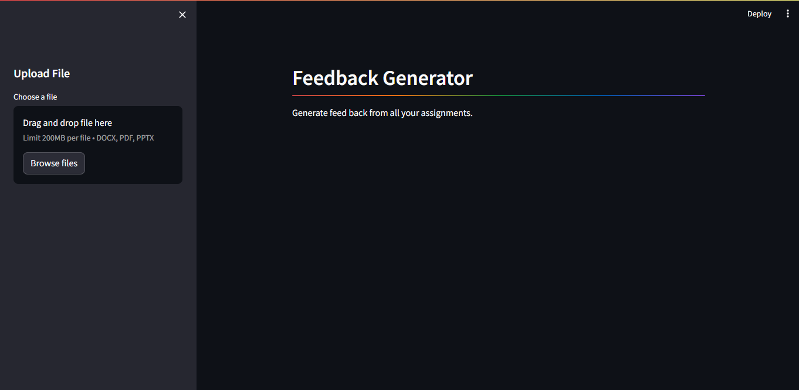

# Homework WizardX

Welcome to the Homework Wizard App, an application powered by cutting-edge language models to provide insightful feedback on your documents, assignments, and homework.



## Overview

The App leverages openAI technology to offer seamless integration, easy installation, and efficient feedback generation. Key features include:

- **Document Analysis**: Comprehensive feedback on documents.
- **Streamlit Interface**: User-friendly interface powered by Streamlit.
- **Easy Installation**: Quick setup process.

## Demo Video

[Download the demo video](./Video/video.mp4)

## Usage

1. **Clone the repository:**

    ```bash
    git clone https://github.com/Danni3-256/Homework-WizardX.git
    cd Homework-WizardX
    ```

2. **Install dependencies:**

    ```bash
    pip install -r requirements.txt
    ```

3. **Create a `.env` file and input your OPEN_API_KEY:**

    ```bash
    OPEN_API_KEY= "your-api-key-here"
    ```

4. **Run the app using Streamlit:**

    ```bash
    streamlit run app.py
    ```

5. **Access the app in your browser at [http://localhost:8501](http://localhost:8501).**

## Support

For any questions, feedback, or support requests, please reach out:

- Contact: [danielokia256@gmail.com](mailto:danielokia256@gmail.com)
- Open an issue


